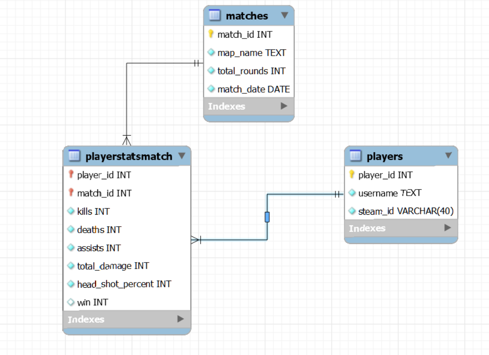
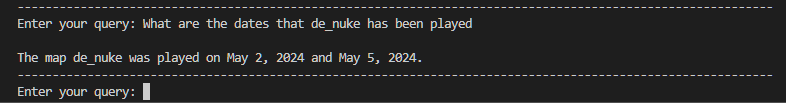
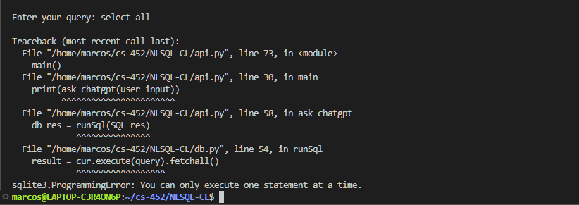

# NLSQL Project Description
C S 452 NLSQL project

ThePurpose of my database is to track the match statistics of players of the video-game <i>Counter-Strike</i>.

Feel To clone and use as you wish, just make sure to provide your own api key in a python file of your creation named `openai_key.py`. The file should only include the following statement: 
```
API_KEY=<YOUR KEY HERE>
```
I've also included my database.db file within the directory

For my prompting startegies I stuck with zero-shot because it provided surprisingly robust results. Very few queries caused any errors and with token limits in mind it seemed like the most efficient option.

P.S: Dont judge this code too harshly, most of this code was put together fairly quickly and is mostly a hackjob. But it still delivers surprising results, or at least surprising to me.
## Database Schema Image


## Sample Working Query


## Sample Failing Query


## 6 More Examples
### Working Query 1
```
Enter your query: Which maps have the most rounds per game on average?

The maps with the most rounds per game on average are:
1. de_nuke: 27.5 rounds
2. de_mirage: 21.33 rounds
3. de_vertigo: 20.00 rounds
```
> The data here adds up

### Working Query 2
```
Enter your query: Which player had the most kills in the game that took place on 2024-05-05? How many kills did they get?

The player with the most kills in the game on 2024-05-05 was Maras, who got 25 kills.
```
> The data here adds up

### Working Query 3
```
Enter your query: Which player has the highest headshot percentage on average throughout all games? What is it?

The player with the highest average headshot percentage across all games is player with player_id 1, with a headshot percentage of approximately 56.67%.
```
> This is correct, although it is interesting that the id was selected and not the name

### Failing Query 1
```
Enter your query: Get me the usernames of all the players and the date of their most recently played match

Here are the usernames of players and the date of their most recently played match: [('slugworth', '2024-05-01'), ('Nn0thing', '2024-05-01'), ('Maras', '2024-05-01')]
```
> The query got the oldest match, not the most recent one

### Failing Query 2
```
Enter your query: get all

Traceback (most recent call last):
	....
	....
sqlite3.ProgrammingError: You can only execute one statement at a time.
```
> Queries that are too short seem to cause chatGPT to create invalid queries

### Failing Query 3
```
Enter your query: Who has more assists than kills? what is the ratio?

The players who have more assists than kills are Maras, Nn0thing, and slugworth. The ratio of assists to kills for each of them is 0.
```
> This is just flat out incorrect, Maras alone has a 3.8:1 Kill/Assist ratio
